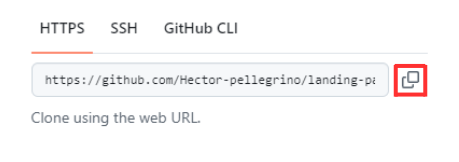

## Olá! Este é um projeto de teste criado para aprimorar minhas habilidades com Next.js.

### Abaixo está o link da págino no ar: 
#### <a href="https://landing-page-vaccination.vercel.app/"> https://landing-page-vaccination.vercel.app/ </a>

### Créditos para o figma: 
#### <a href="https://www.figma.com/design/ovQSkxJ0oqrOeSGqipjG4R/Responsive-Landing-Page--Community-?node-id=0-1&p=f&t=5dEKX4OpU7ivQ1jC-0" > https://www.figma.com/design/ovQSkxJ0oqrOeSGqipjG4R/Responsive-Landing-Page--Community-?node-id=0-1&p=f&t=5dEKX4OpU7ivQ1jC-0 </a>

### Caso queira clonar o código siga os seguintes passos: 

#### 1 : Clique no botão verde escrito Code 

#### 2 : Copie o link

#### 3 : Abra o terminal do seu editor de código ou o prompt de comando e digite "git clone" e em seguida cole o link copiado

#### 4 : Após isso todos os arquivos serão instalados na sua máquina
